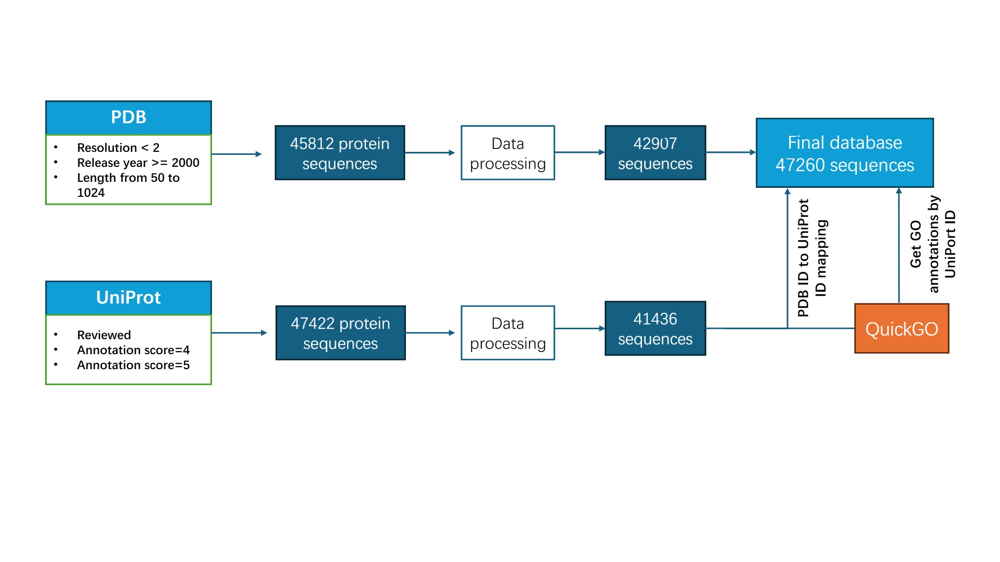

# Membrane-Protein-Function-Research

This repo is for membrane protein function prediction research. Here we introduce the files briefly: 

- membrane_proteins_original.xlsx

We collected data of a total of 47,260 membrane proteins from the PDB and UniProt databases.

- membrane_proteins.xlsx

Based on the original data file, the GO annotations of the sequence are expanded through the QuickGO database.

- membrane_proteins_supplement_GOs_domain_filtered.xlsx

We removed those proteins without domains from InterPro database that left us 44539 records.
